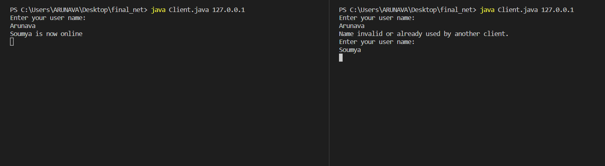
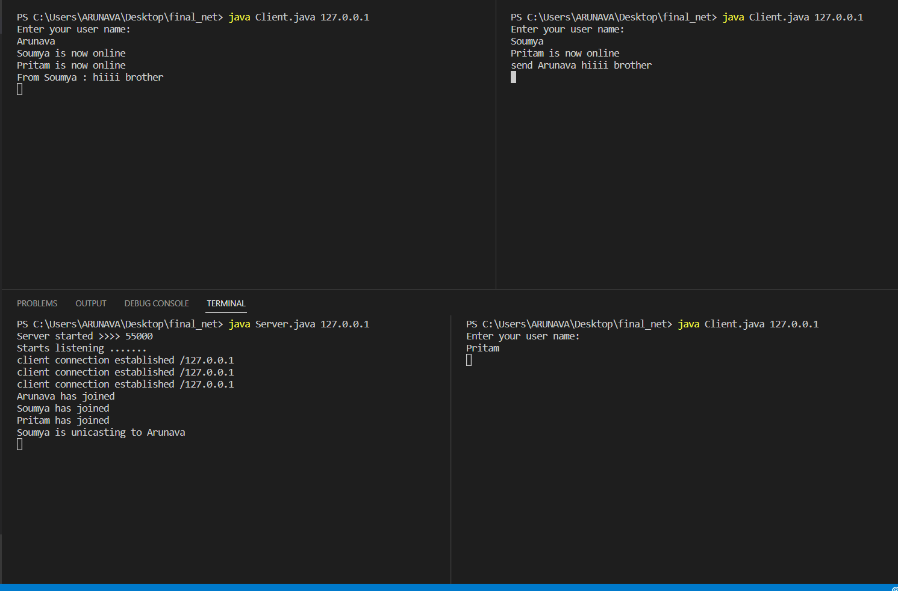
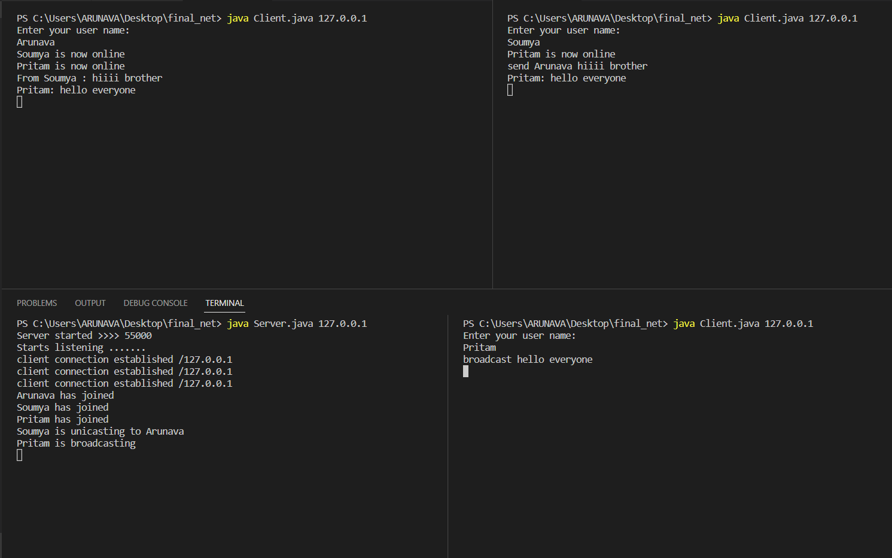
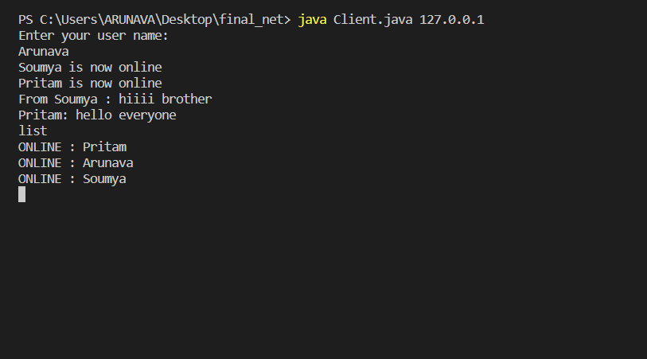
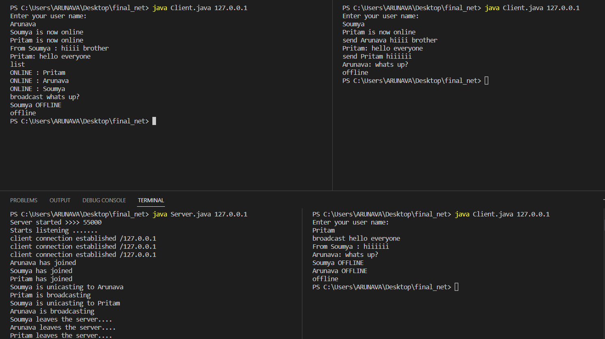

# TCP_CHAT_SYSTEM using java socket programming
## COMMANDS
>> For unicasting : send receiver_name messagge <br>
>> For broadcasting : broadcast message <br>
>> To list online clients : list <br>
>> to go offline : offline <br>
``` Duplicate client name prevention```<br>
 <br>
``` Unicast``` <br>
 <br>
``` Broadcast``` <br>
 <br>
``` List``` <br>
 <br>
``` Offline``` <br>
 <br>
